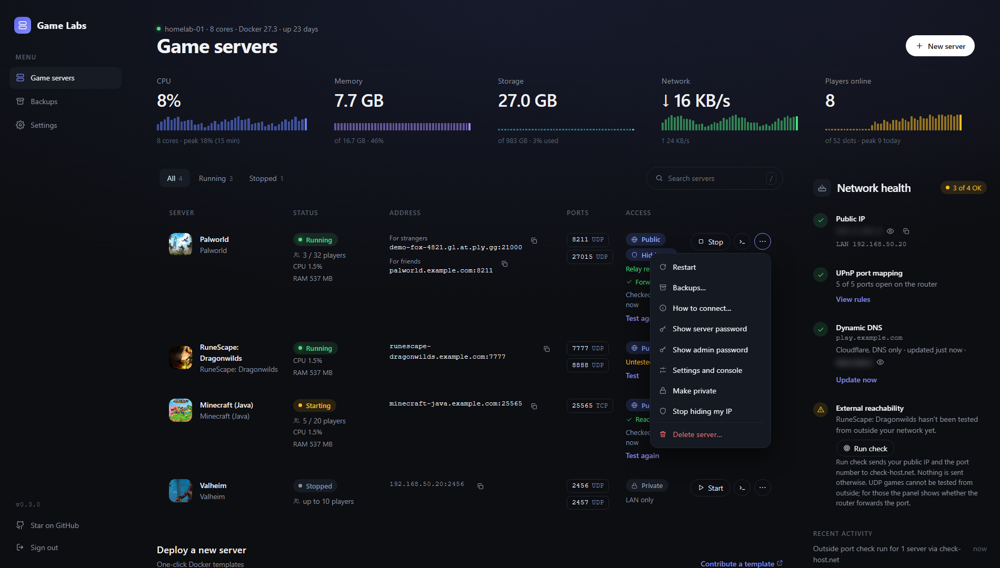
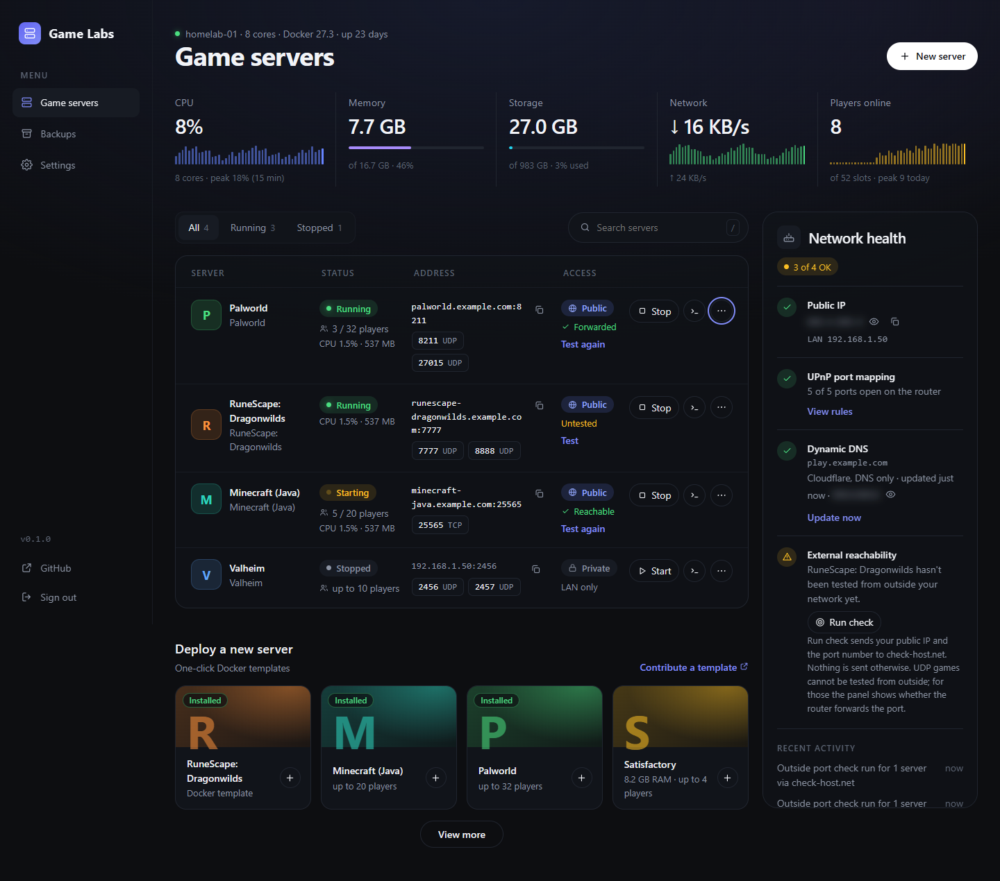

# Self Hosted Game Labs

**Run game servers at home without becoming a sysadmin.** Game Labs is an open-source control panel for your own hardware. Pick a game, click deploy, and the panel starts the container, opens the ports on your router, keeps a friendly name pointed at your home IP, and backs up your world. Friends join from the internet; you never touch Docker commands, your router's admin page or a DNS dashboard after first-time setup. Players connect straight to your home internet connection, so they can see your home IP (see [Your home IP is visible to players](#your-home-ip-is-visible-to-players)).


> **Early release (v0.2.1).** Palworld and RuneScape: Dragonwilds are running on a real homelab, with friends joining over the internet. The other games are built and tested against fakes and throwaway containers but not played on yet. See [Supported games](#supported-games) and [docs/verification.md](docs/verification.md) for exactly what has and has not been tried.

## What's new in 0.2.1

- **Real store pictures on the template cards.** A template can now point at a game's artwork with an artwork URL, and the card shows it as its banner.
- **Credit and framing.** `artworkCredit` names where a picture came from, and `artworkPosition` chooses which part of the picture the banner keeps.
- **Fetched once.** The panel downloads each picture the first time it is needed and serves it from its own cache after that, so the browser never loads it from the store.
- **Safe fallback.** A template with no artwork, or one whose picture cannot be fetched, keeps the gradient banner it had before.

## What's new in 0.2.0

- **A new look.** The whole panel is redesigned in a lighter, free-floating style: no heavy boxes, one calm theme across the server list, Backups, Network health and Settings.
- **A condensed server page** that fits what you need on one screen.
- **Player counts for Palworld** through the game's own API, shown in the server row and the Players tile.
- **Port checks are remembered.** The result of "Run check" is saved with the server, so it is still there after a restart, and the panel says when it has gone stale (for example, your public IP changed).
- **Palworld console fixed.** RCON is now switched on for new Palworld servers, and an older server tells you in the console that it needs to be recreated.
- **Backups restyled** to match the rest of the panel.
- **CPU and memory sparklines** in every server row, from the panel's own sample history.
- **Faster navigation.** Moving between pages shows what was there last time straight away and refreshes it in the background, next pages are fetched when you point at the link, and the first load shows placeholders instead of empty boxes. The template cards no longer flash oversized while the page fills in.

## What you get

- **One-click game templates** for Palworld, RuneScape: Dragonwilds, Minecraft (Java), Valheim, Satisfactory and Terraria, plus a **Custom Docker image** card for anything else.
- **Daily restarts and updates:** restart a server every day at a time you pick (with an in-game warning for games that can show one), check for a newer version of a game and switch to it after a backup, and move a server to another port, all from its page.
- **Start, stop, restart, delete and live logs** for every server from one page, with CPU, memory and player counts.
- **Private or Public per server.** Each row says which, and whether the server was reachable from outside. Public opens the game ports on your router (UPnP automatically, or a checklist of rules if your router has no UPnP) and gives the server a DNS name such as `palworld.example.com`.
- **Backups that outlive the server.** Worlds are backed up automatically and on demand, deleting a server never deletes its backups, and a deleted server can be set up again from its backup.
- **An honest Network health checklist.** Public IP (blurred until you click the eye), router ports, your dynamic DNS record and whether your servers can be reached from outside, each with one button for what to do about it. The outside check never says "open" without a real test.
- **Setup inside the app.** Cloudflare is connected on the panel's Settings page, game options are edited on each server's page, and backup schedules on the Backups page, so there are no environment variables to juggle.

## Screenshots

These are generated from the real app against a fake Docker and router with demo servers (see [docs/capture-screenshots.ts](docs/capture-screenshots.ts)). The demo public IP is blurred, as it is by default in the app.

### The server list

Each row has a Stop/Start button, logs and a **...** menu (restart, backups, passwords, settings, make public or private, delete). The charts show the last 15 minutes the panel measured, and the player peak is today's highest count. The Network health panel sits beside the table, and moves under it on narrower windows; on a phone each server is a card.




### A server's page

Rename it, edit its game settings (changing one recreates the container; the world and backups are not touched), run console commands for games that support it, and read the recent activity.


### Backups

Every backup in one place, including those of servers you have deleted. Pick one and press **Set up again** to bring a deleted world back.


### Network health

What the router forwards, what name your servers have, and a check from outside the house. The public IP stays blurred until you reveal it, so a screenshot of your dashboard does not leak it.


## Quick start

You need a Linux machine with Docker and Docker Compose. It also works from a Git-based stack deploy (Dockhand, Portainer and similar).

```bash
curl -O https://raw.githubusercontent.com/LordMerc/self-hosted-game-labs/main/compose.image.yaml
docker compose -f compose.image.yaml up -d
```

That pulls the published image, `ghcr.io/lordmerc/self-hosted-game-labs` (amd64 and arm64), and starts the panel. Open `http://<server-lan-ip>:8090` and **set the admin password on first run**.

Everything below is optional. Set variables in a `.env` file next to the compose file, or in your stack tool's environment panel:

| Variable | What it does |
| --- | --- |
| `GAME_DATA_DIR` | Where game servers keep their files, worlds and backups. Default `/srv/gameservers`. Point it at a bigger drive if you like (the drive must be mounted first). |
| `CONNECTIVITY=upnp` | Let the panel open and close router ports itself. The default, `manual`, shows you the rules to add instead. |
| `PANEL_PORT` | Port for the panel itself. Default `8090`. |
| `HOST_LAN_IP` | Only if the panel guesses your machine's LAN address wrong. |
| `IMAGE_TAG` | `latest` follows every release; pin a version such as `0.2.0` to stay put. |
| `BACKUP_KEEP` | Backups kept per server. Default `7`; a backup is never removed before it is 7 days old. |
| `UPDATE_CHECK=off` | Stops the daily check that asks GitHub whether a newer release exists (it only shows a notice and never updates anything). Also a checkbox in Settings. |
| `TRUST_PROXY`, `PANEL_HOST` | Only if you put the panel behind a reverse proxy; see the guide below. |
| `PORT_CHECK=off` | Removes the outside port check, which otherwise sends your public IP and one port to check-host.net when you press Run. |

The full list, with comments, is in [.env.example](.env.example).

**Do this before exposing anything:** the panel has access to the Docker socket, which is root-equivalent control of the host. Keep it on your LAN or behind a VPN such as Tailscale. Never port forward the panel itself. The first-run password screen is open to anyone who can reach the port until you complete it, so do it right after starting the container. Repeated wrong passwords lock a visitor out. If you want a web address for the panel, [Exposing the panel safely](docs/exposing-the-panel.md) covers HTTPS with Caddy, Nginx or Cloudflare Tunnel (for the panel's web page only, never for players), and what the game ports need.

### Prefer to build from source?

```bash
cp .env.example .env     # optional
docker compose up -d --build
```

`compose.yaml` builds the image on your machine; it is also the file Git-based stack deploys need. Set the same variables as environment variables on the stack instead of using a `.env` file.

### Using it

1. Click a game under **Deploy a new server**, fill in the few options it asks for, and press **Deploy**. The first start downloads the game, which can take a few minutes; the server shows **Starting** until its port is open.
2. Click **Public** on the server to let friends in. The panel opens the ports on your router and shows the address to give them.
3. Open **Settings** to connect a domain (see [Domain names](#domain-names-optional)). Open **Backups** to see, restore or delete backups.

## Supported games

| Game | Image | Tried on real hardware? |
| --- | --- | --- |
| Palworld | `thijsvanloef/palworld-server-docker` | **Yes.** Friends joined from the internet. |
| RuneScape: Dragonwilds | `ghcr.io/runescape/rsdw-dedicated` | **Yes.** Runs a migrated world. Doors lag on any hosted server (a game quirk); chests and loot are fine. |
| Terraria | `beardedio/terraria` | Started and restarted in a throwaway Docker; no one has joined. |
| Valheim | `ghcr.io/community-valheim-tools/valheim-server` | Not yet. The older Docker Hub name of the same image was started. |
| Satisfactory | `wolveix/satisfactory-server` | Not yet. Starts its download; needs about 8 GB of free memory. |
| Minecraft (Java) | `itzg/minecraft-server` | Not yet. Needs you to accept the Minecraft EULA in the deploy form. |
| Anything else | your own image | Not yet. Use **Custom Docker image** and type the image and its ports. |

Templates are plain YAML files in [`templates/`](templates), so adding a game is a pull request away. If you try one of the untested games, please tell us how it went in an issue.

## How it works

The panel is one container with the Docker socket mounted. Each game server is its own Docker container named `gl-<name>`, so restarting or redeploying the panel never stops your games; they are picked up again on the next start. Ports are opened on your router with UPnP (or by you, with the panel's checklist), and DNS names are Cloudflare records created by the panel and tagged so it only ever changes its own.

Design notes are in [docs/design.md](docs/design.md); what is built and what is next is in [docs/ROADMAP.md](docs/ROADMAP.md) and [docs/MVP.md](docs/MVP.md); [docs/verification.md](docs/verification.md) records what has been run against real Docker, routers and Cloudflare.

**Stack:** Node 22 + TypeScript, Fastify API, React + Vite frontend served by the same process, SQLite (better-sqlite3 + Drizzle), `dockerode`, Vitest and a Playwright browser test.

### Port check, in short

Press **Test** on a server's row (or **Run check** in Network health) to test a public server's TCP ports from outside. UDP games cannot be tested that way, so the panel shows whether the router forwards the port and never says "open" without a real test. The test sends your public IP and port to a third-party checker (check-host.net) only when you press one of those; set `PORT_CHECK=off` to remove it.

## Trying changes before a release

You can run a second copy of the panel next to your real one to preview a branch before it reaches everyone. Give the copy its own name with `INSTANCE`, so the two panels never touch each other's game servers, router rules or DNS records, and give it its own port and game data folder.

With Dockhand (or any Git-based stack deploy), create a second stack, for example `gamelabs-beta`, from the same repository:

- **Branch:** the branch you want to try (a feature branch, or `beta`). Compose file: `compose.yaml` (builds from source on your machine).
- **Environment variables:** `INSTANCE=beta`, `PANEL_PORT=8091`, and `GAME_DATA_DIR` set to a folder the real panel does not use (for example `/srv/gameservers-beta`).
- Keep the stack name different from the real one, so it gets its own `gamelabs-data` volume and its own admin password.

If you would rather test the prebuilt preview image, pushes to the `beta` branch publish `ghcr.io/lordmerc/self-hosted-game-labs:beta`. Use `compose.image.yaml` with `IMAGE_TAG=beta` and the same variables.

Things to know:

- The beta panel's containers are named `gl-beta-<name>`; the real panel keeps `gl-<name>`. Each panel only ever starts, stops, changes, backs up or deletes its own. The beta panel does list the real panel's servers under "Run by another panel" (name, status, image, ports) so you can see them, but that list is read-only, with no buttons.
- Game ports are shared by the whole machine. To test deploying Palworld in the beta panel, stop the real Palworld server first (or test a game you are not running), otherwise the port is already taken.
- Leave router automation and Cloudflare off in the beta panel (`CONNECTIVITY` defaults to `manual`), and use different server names, so it cannot change your real DNS or router rules.
- Promote a tested change the normal way: open a pull request into `main`, merge it, and (optionally) tag a release.

## Limiting CPU and memory (optional)

On a machine that runs several games, one busy server can slow the others down. When you deploy a server, or later on its page, you can cap the most CPU cores and memory it may use. Leave a box empty for no limit, which is the default. Changing a limit restarts that server (your world is kept) because Docker applies the limits when the container is created.

- The CPU limit is in cores, up to the number your machine has (for example `2` or `1.5`).
- The memory limit is in GB and is a hard cap with no swap. A game that goes over it is stopped and restarted by Docker, so keep it above what the game needs, and above any memory setting the game has itself (such as Minecraft's `MEMORY`). The panel warns you when a limit is below what a template says its game needs (Satisfactory: about 8 GB).

## Restarts, updates and ports (optional)

Open a server and look for **Restarts and updates** and **Ports**.

- **Daily restart:** tick the box and pick a time. Games with a way to talk to players (Palworld and Minecraft) can warn them in the game 15, 10, 5 or 1 minutes before the restart, and again 1 minute before. A stopped server is left stopped. The time uses the panel's time zone, which is UTC unless you set `TZ` (for example `TZ=America/Chicago`).
- **Updates:** **Check for update** tells you if a newer version exists. Palworld is pinned to a version that is known to work (`v2.8.0`) instead of `latest`, so a new image can never change your server by surprise: the panel lists newer version tags from Docker Hub, shows **Update available** in the server list, and moves to the new one when you press **Update**. Games without version tags are checked by downloading the image and comparing it with the one the server runs. Every update makes a backup first and keeps your world. **Update automatically every day** does the same on a schedule, for running servers only. If a new version misbehaves, delete the server (keeping its data) and set it up again from the Backups page, which uses the version in the template.
- **Ports:** change the game port; the game's other ports move by the same amount, the router rules move too, and the server restarts with your world kept. Custom images cannot change ports because the image decides them.

## Domain names (optional)

Without a domain, public servers are reached by your IP address. To get names like `palworld.example.com`, open **Settings** in the panel, paste a Cloudflare API token and pick your domain. The panel lists the steps. In short: create a custom token at Cloudflare with **Zone · Zone · Read** and **Zone · DNS · Edit**, limited to your domain. The panel creates DNS-only records (never proxied) and keeps them pointed at your current IP, and it only ever changes records it created. DNS-only means Cloudflare is only the phone book: it is not a proxy and does not hide your home IP, and anyone who looks up the name can see it. You can instead set `CF_API_TOKEN`, `CF_ZONE` and `PUBLIC_HOST` as environment variables, which override the Settings page.

## Your home IP is visible to players

Players connect directly to your home internet connection. Anyone who looks up your server's name (or joins by IP address) can see your home public IP. The Cloudflare records are DNS-only, not a proxy, so they do not hide it. Cloudflare's proxy and Cloudflare Tunnel cannot carry game traffic, so they are no help here either; the Tunnel in [Exposing the panel safely](docs/exposing-the-panel.md) is only for the panel's own web page.

This is how any game server hosted at home with port forwarding works. What the panel does to limit the exposure: it only opens the game ports of servers you set to Public, it never forwards the panel itself, and servers set to Private have no router rules at all. Game Labs has no VPN or DDoS protection. If you do not want players to learn your IP, turn on **Hide my IP** for the server (a free playit.gg relay, see [Hide my IP (optional)](#hide-my-ip-optional); friends install nothing). The other ways are to keep servers Private and have friends join over a VPN such as Tailscale (each friend installs it), or to put a relay you run yourself in front of the game ports.

## Hide my IP (optional)

A direct public server shows your home IP to anyone who joins. In **Settings → Hide my IP (playit.gg)** you can paste the secret key of a free [playit.gg](https://playit.gg) agent and then turn on **Hide my IP** for a server. Players get a playit.gg address, which goes through the relay instead of your router, and friends install nothing. It works with an agent you already run, or the panel can run one. Details, limits and what is still untested are in [docs/relay-playit.md](docs/relay-playit.md).

**Hide my IP is a switch of its own, beside Private and Public.** You can use both at once:

| Access | Hide my IP | What it gives you |
| --- | --- | --- |
| Private | off | Home network only. |
| Private | on | The playit.gg address only (plus the home network address for you). Nothing is opened on your router and there is no DNS record. |
| Public | off | The Cloudflare name, straight to your home connection. |
| Public | on | Both: the Cloudflare name for friends you trust with your IP, and the playit.gg address for strangers. The router rules, the DNS record and the port checks stay as they are. |

Turning **Hide my IP** off only removes the relay address. Tunnels you made by hand stay in your playit.gg account, so turning it back on brings the same address back. (Tunnels the panel created itself are removed and recreated.) Servers saved by an earlier version as "Hide my IP" become Private with Hide my IP on.

**If playit.gg will not let the panel create tunnels** (agent keys can be read-only, so it may refuse), the panel tells you and opens a step-by-step window instead. You add the tunnels yourself, once per server, in the [playit.gg Tunnels page](https://playit.gg/account/tunnels):

1. Click **Add Tunnel** and name it exactly as the window says: `gl-<server>-<port>`, for example `gl-palworld-8211`. The panel finds your tunnel by that name.
2. Pick the tunnel type (the game's own preset or Custom UDP/TCP) and your agent, with the free network.
3. Set **Local IP** to your machine's home network address (for example `192.168.1.20`), and **Local Port** to the game port. Do not leave it at `127.0.0.1` if your playit.gg agent runs in its own Docker container (for example one deployed from Dockhand): that container would look for the game inside itself. The panel's setting for this defaults to your home network address.
4. Add one tunnel for each game port listed. When they exist, the panel picks them up on its own within a few seconds and shows the playit.gg address to share with friends. The dialog lists every field to copy.

**Why not Cloudflare for this?** Cloudflare can hide your IP for websites, but not for game servers on the free plan. Its proxy only carries web traffic. Cloudflare Tunnel needs every friend to install Cloudflare's WARP app. Spectrum, which carries other kinds of game traffic, is an Enterprise product. A playit.gg tunnel is the free option where friends install nothing.

## Notifications (optional)

Open **Settings → Notifications**, paste a Discord webhook address (the panel lists the steps: Edit Channel, Integrations, Webhooks, New Webhook, Copy Webhook URL) and press **Send test message**. The panel can then post when a server comes online, goes down or crashes (including a game that Docker restarted after a crash), when a player joins or leaves (for games that report player counts), and when a backup fails. Each of those is a checkbox, and player leaves start off because they are chatty. A server you stop or restart from the panel is never reported as a crash. Any other service that accepts a JSON webhook (Slack, Mattermost, n8n, Home Assistant) works too: it receives `content`, `text`, `event`, `server`, `title`, `message` and `at` fields. The address is stored encrypted and is never shown again. A beta panel (`INSTANCE`) puts its name in front of every message so you can tell the copies apart.

## Where game data is stored

Game servers keep their files (including world saves) under `GAME_DATA_DIR`, `/srv/gameservers` by default, one folder per server. Set `GAME_DATA_DIR` to a path on another drive (for example `/mnt/games`) to keep them off your system disk. The drive must be mounted before the panel starts, or Docker will quietly create the folder on the system disk. Changing it affects servers deployed afterwards; existing servers keep their current folder until they are redeployed (delete the server, which keeps its data, move the folder, then deploy again with the same name). Docker's own image downloads live in Docker's data root, which is a Docker daemon setting rather than something the panel controls.

## Development

```bash
npm ci
npm test               # unit and API tests
npm run build:web && npm run test:e2e   # browser smoke test (needs Chromium: npx playwright install chromium)
npm run typecheck
npm run dev:server     # needs SESSION_SECRET (32+ chars) and DATA_DIR, e.g. DATA_DIR=./data
npm run dev:web        # Vite dev server, proxies /api to :8090
```

Game templates live in `templates/*.yaml` and are validated on startup against `src/shared/template.ts`. Unknown keys are rejected, so a template cannot request privileged mode, host networking or arbitrary bind mounts.

To regenerate the screenshots in [docs/images](docs/images) after a UI change: `npm run build:web && npx tsx docs/capture-screenshots.ts`.

## Contributing

Changes go through pull requests so CI can check them; see [CONTRIBUTING.md](CONTRIBUTING.md). Bug reports and game requests are welcome as issues.

## License

MIT
