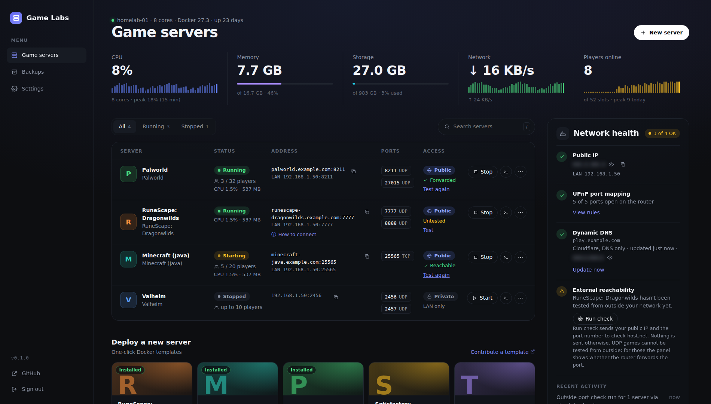
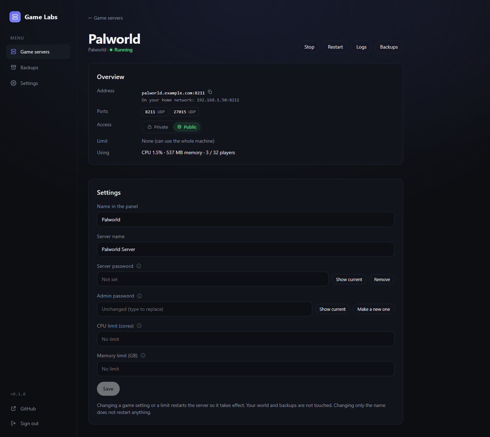
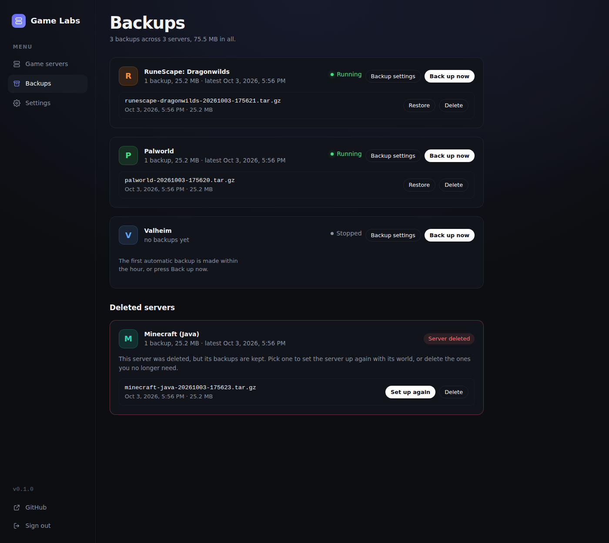
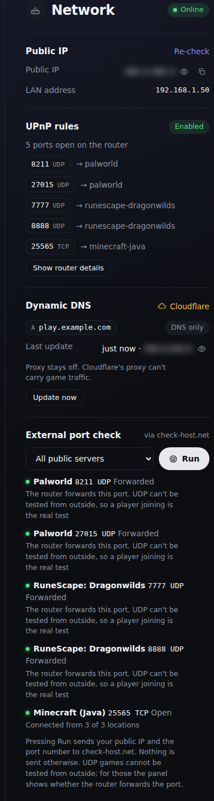

# Self Hosted Game Labs

**Run game servers at home without becoming a sysadmin.** Game Labs is an open-source control panel for your own hardware. Pick a game, click deploy, and the panel starts the container, opens the ports on your router, keeps a friendly name pointed at your home IP, and backs up your world. Friends join from the internet; you never touch Docker commands, your router's admin page or a DNS dashboard after first-time setup.



> **Early release (v0.1.0).** Palworld and RuneScape: Dragonwilds are running on a real homelab, with friends joining over the internet. The other games are built and tested against fakes and throwaway containers but not played on yet. See [Supported games](#supported-games) and [docs/verification.md](docs/verification.md) for exactly what has and has not been tried.

## What you get

- **One-click game templates** for Palworld, RuneScape: Dragonwilds, Minecraft (Java), Valheim, Satisfactory and Terraria, plus a **Custom Docker image** card for anything else.
- **Start, stop, restart, delete and live logs** for every server from one page, with CPU, memory and player counts.
- **A Private / Public switch per server.** Public opens the game ports on your router (UPnP automatically, or a checklist of rules if your router has no UPnP) and gives the server a DNS name such as `palworld.example.com`.
- **Backups that outlive the server.** Worlds are backed up automatically and on demand, deleting a server never deletes its backups, and a deleted server can be set up again from its backup.
- **An honest Network panel.** It shows your public IP (blurred until you click the eye), the router rules the panel opened, your dynamic DNS record, and an optional outside port check that never says "open" without a real test.
- **Setup inside the app.** Cloudflare is connected on the panel's Settings page, game options are edited on each server's page, and backup schedules on the Backups page, so there are no environment variables to juggle.

## Screenshots

These are generated from the real app against a fake Docker and router with demo servers (see [docs/capture-screenshots.ts](docs/capture-screenshots.ts)). The demo public IP is blurred, as it is by default in the app.

### A server's page

Rename it, edit its game settings (changing one recreates the container; the world and backups are not touched), run console commands for games that support it, and read the recent activity.



### Backups

Every backup in one place, including those of servers you have deleted. Pick one and press **Set up again** to bring a deleted world back.



### The Network panel

What the router forwards, what name your servers have, and a check from outside the house. The public IP stays blurred until you reveal it, so a screenshot of your dashboard does not leak it.



## Quick start

You need a Linux machine with Docker and Docker Compose. It also works from a Git-based stack deploy (Dockhand, Portainer and similar).

```bash
curl -O https://raw.githubusercontent.com/LordMerc/self-hosted-game-labs/main/compose.image.yaml
docker compose -f compose.image.yaml up -d
```

That pulls the published image, `ghcr.io/lordmerc/self-hosted-game-labs` (amd64 and arm64), and starts the panel. Open `http://<server-lan-ip>:8090` and **set the admin password on first run**.

Everything below is optional. Set variables in a `.env` file next to the compose file, or in your stack tool's environment panel:

| Variable | What it does |
| --- | --- |
| `GAME_DATA_DIR` | Where game servers keep their files, worlds and backups. Default `/srv/gameservers`. Point it at a bigger drive if you like (the drive must be mounted first). |
| `CONNECTIVITY=upnp` | Let the panel open and close router ports itself. The default, `manual`, shows you the rules to add instead. |
| `PANEL_PORT` | Port for the panel itself. Default `8090`. |
| `HOST_LAN_IP` | Only if the panel guesses your machine's LAN address wrong. |
| `IMAGE_TAG` | `latest` follows every release; pin a version such as `0.1.0` to stay put. |
| `BACKUP_KEEP` | Backups kept per server. Default `7`; a backup is never removed before it is 7 days old. |
| `PORT_CHECK=off` | Removes the outside port check, which otherwise sends your public IP and one port to check-host.net when you press Run. |

The full list, with comments, is in [.env.example](.env.example).

**Do this before exposing anything:** the panel has access to the Docker socket, which is root-equivalent control of the host. Keep it on your LAN or behind a VPN such as Tailscale. Never port forward the panel itself. The first-run password screen is open to anyone who can reach the port until you complete it, so do it right after starting the container.

### Prefer to build from source?

```bash
cp .env.example .env     # optional
docker compose up -d --build
```

`compose.yaml` builds the image on your machine; it is also the file Git-based stack deploys need. Set the same variables as environment variables on the stack instead of using a `.env` file.

### Using it

1. Click a game under **Deploy a new server**, fill in the few options it asks for, and press **Deploy**. The first start downloads the game, which can take a few minutes; the server shows **Starting** until its port is open.
2. Click **Public** on the server to let friends in. The panel opens the ports on your router and shows the address to give them.
3. Open **Settings** to connect a domain (see [Domain names](#domain-names-optional)). Open **Backups** to see, restore or delete backups.

## Supported games

| Game | Image | Tried on real hardware? |
| --- | --- | --- |
| Palworld | `thijsvanloef/palworld-server-docker` | **Yes.** Friends joined from the internet. |
| RuneScape: Dragonwilds | `ghcr.io/runescape/rsdw-dedicated` | **Yes.** Runs a migrated world. Doors lag on any hosted server (a game quirk); chests and loot are fine. |
| Terraria | `beardedio/terraria` | Started and restarted in a throwaway Docker; no one has joined. |
| Valheim | `ghcr.io/community-valheim-tools/valheim-server` | Not yet. The older Docker Hub name of the same image was started. |
| Satisfactory | `wolveix/satisfactory-server` | Not yet. Starts its download; needs about 8 GB of free memory. |
| Minecraft (Java) | `itzg/minecraft-server` | Not yet. Needs you to accept the Minecraft EULA in the deploy form. |
| Anything else | your own image | Not yet. Use **Custom Docker image** and type the image and its ports. |

Templates are plain YAML files in [`templates/`](templates), so adding a game is a pull request away. If you try one of the untested games, please tell us how it went in an issue.

## How it works

The panel is one container with the Docker socket mounted. Each game server is its own Docker container named `gl-<name>`, so restarting or redeploying the panel never stops your games; they are picked up again on the next start. Ports are opened on your router with UPnP (or by you, with the panel's checklist), and DNS names are Cloudflare records created by the panel and tagged so it only ever changes its own.

Design notes are in [docs/design.md](docs/design.md); what is built and what is next is in [docs/ROADMAP.md](docs/ROADMAP.md) and [docs/MVP.md](docs/MVP.md); [docs/verification.md](docs/verification.md) records what has been run against real Docker, routers and Cloudflare.

**Stack:** Node 22 + TypeScript, Fastify API, React + Vite frontend served by the same process, SQLite (better-sqlite3 + Drizzle), `dockerode`, Vitest and a Playwright browser test.

### Port check, in short

Press Run in the Network panel to test a public server's TCP ports from outside. UDP games cannot be tested that way, so the panel shows whether the router forwards the port and never says "open" without a real test. The test sends your public IP and port to a third-party checker (check-host.net) only when you press Run; set `PORT_CHECK=off` to remove it.

## Trying changes before a release

You can run a second copy of the panel next to your real one to preview a branch before it reaches everyone. Give the copy its own name with `INSTANCE`, so the two panels never touch each other's game servers, router rules or DNS records, and give it its own port and game data folder.

With Dockhand (or any Git-based stack deploy), create a second stack, for example `gamelabs-beta`, from the same repository:

- **Branch:** the branch you want to try (a feature branch, or `beta`). Compose file: `compose.yaml` (builds from source on your machine).
- **Environment variables:** `INSTANCE=beta`, `PANEL_PORT=8091`, and `GAME_DATA_DIR` set to a folder the real panel does not use (for example `/srv/gameservers-beta`).
- Keep the stack name different from the real one, so it gets its own `gamelabs-data` volume and its own admin password.

If you would rather test the prebuilt preview image, pushes to the `beta` branch publish `ghcr.io/lordmerc/self-hosted-game-labs:beta`. Use `compose.image.yaml` with `IMAGE_TAG=beta` and the same variables.

Things to know:

- The beta panel's containers are named `gl-beta-<name>`; the real panel keeps `gl-<name>`. Each panel only ever starts, stops, changes, backs up or deletes its own. The beta panel does list the real panel's servers under "Run by another panel" (name, status, image, ports) so you can see them, but that list is read-only, with no buttons.
- Game ports are shared by the whole machine. To test deploying Palworld in the beta panel, stop the real Palworld server first (or test a game you are not running), otherwise the port is already taken.
- Leave router automation and Cloudflare off in the beta panel (`CONNECTIVITY` defaults to `manual`), and use different server names, so it cannot change your real DNS or router rules.
- Promote a tested change the normal way: open a pull request into `main`, merge it, and (optionally) tag a release.

## Domain names (optional)

Without a domain, public servers are reached by your IP address. To get names like `palworld.example.com`, open **Settings** in the panel, paste a Cloudflare API token and pick your domain. The panel lists the steps. In short: create a custom token at Cloudflare with **Zone · Zone · Read** and **Zone · DNS · Edit**, limited to your domain. The panel creates DNS-only records (never proxied) and keeps them pointed at your current IP, and it only ever changes records it created. You can instead set `CF_API_TOKEN`, `CF_ZONE` and `PUBLIC_HOST` as environment variables, which override the Settings page.

## Notifications (optional)

Open **Settings → Notifications**, paste a Discord webhook address (the panel lists the steps: Edit Channel, Integrations, Webhooks, New Webhook, Copy Webhook URL) and press **Send test message**. The panel can then post when a server comes online, goes down or crashes (including a game that Docker restarted after a crash), when a player joins or leaves (for games that report player counts), and when a backup fails. Each of those is a checkbox, and player leaves start off because they are chatty. A server you stop or restart from the panel is never reported as a crash. Any other service that accepts a JSON webhook (Slack, Mattermost, n8n, Home Assistant) works too: it receives `content`, `text`, `event`, `server`, `title`, `message` and `at` fields. The address is stored encrypted and is never shown again. A beta panel (`INSTANCE`) puts its name in front of every message so you can tell the copies apart.

## Where game data is stored

Game servers keep their files (including world saves) under `GAME_DATA_DIR`, `/srv/gameservers` by default, one folder per server. Set `GAME_DATA_DIR` to a path on another drive (for example `/mnt/games`) to keep them off your system disk. The drive must be mounted before the panel starts, or Docker will quietly create the folder on the system disk. Changing it affects servers deployed afterwards; existing servers keep their current folder until they are redeployed (delete the server, which keeps its data, move the folder, then deploy again with the same name). Docker's own image downloads live in Docker's data root, which is a Docker daemon setting rather than something the panel controls.

## Development

```bash
npm ci
npm test               # unit and API tests
npm run build:web && npm run test:e2e   # browser smoke test (needs Chromium: npx playwright install chromium)
npm run typecheck
npm run dev:server     # needs SESSION_SECRET (32+ chars) and DATA_DIR, e.g. DATA_DIR=./data
npm run dev:web        # Vite dev server, proxies /api to :8090
```

Game templates live in `templates/*.yaml` and are validated on startup against `src/shared/template.ts`. Unknown keys are rejected, so a template cannot request privileged mode, host networking or arbitrary bind mounts.

To regenerate the screenshots in [docs/images](docs/images) after a UI change: `npm run build:web && npx tsx docs/capture-screenshots.ts`.

## Contributing

Changes go through pull requests so CI can check them; see [CONTRIBUTING.md](CONTRIBUTING.md). Bug reports and game requests are welcome as issues.

## License

MIT
